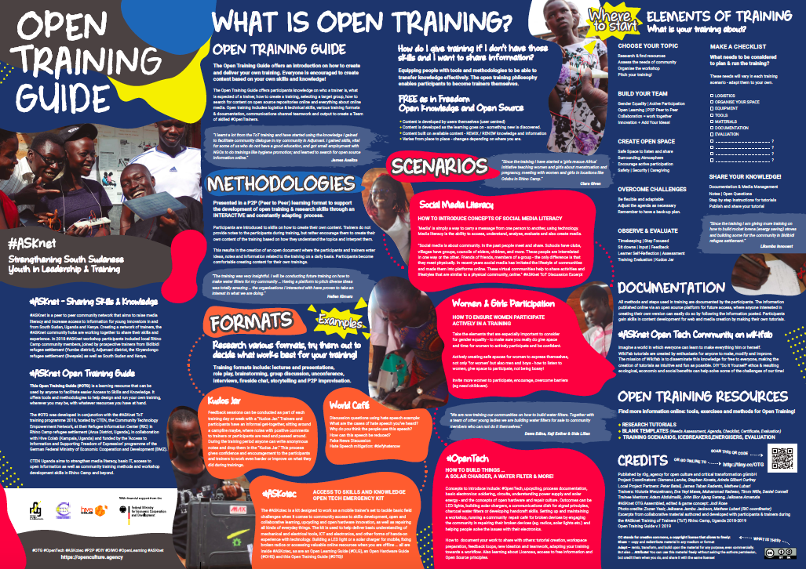

# #ASKnet Open-Training-Guide

This repository includes the material (texts / graphics / Source file / pdf) of the #ASKnet __Open Training Guide__ poster .

More about [#ASKnet](https://www.asknet.community/) here.

\#ASKnet - Strengthening South Sudanese Youth in Leadership &amp; Training

\#ASKnet - Sharing Skills and Knowledge

\#ASKnet is a peer to peer community network that aims to raise media literacy and increase access to information for young innovators in and from South Sudan, Uganda and Kenya. Creating a network of trainers, the #ASKnet community hubs are working together to share their skills and experience. In 2018 #ASKnet workshop participants included local Rhino Camp community members, joined by prospective trainers from Bidibidi refugee settlement (Yumbe district), Adjumani district, the Kiryandongo refugee settlement (Bweyale) as well as South Sudan and Kenya.
Open Training Guide

This Open Training Guide (#OTG) is a learning resource that can be used by anyone to facilitate easier Access to Skills and Knowledge. It offers tools and methodologies to help design and run your own training, wherever you may be, with whatever resources you have at hand.

## Design Description

# **Color scheme + Hex Color Codes:**

###  front page:

*  Background light: #F6F8CE
*  Background darker: #F3F5BA
*  Background darkest: #F1F3A5

###  back page

*  Background light: #F6F8CE

### graphics + font colors (black, white and colors)

*  t-shirt 1 (Blue): #529FCC
*  t-shirt 2 (Blue): #57AEE1
*  Blazer (Blue): #5594A6

# **Fonts used:**

* **Titles & Subtitles:** Whatever It Takes [Download Font](https://www.dafont.com/whatever-it-takes.font)
* **Body Text:**  Roboto [Download Font](https://www.1001freefonts.com/roboto.font)

# **Text:**

You can acess the text files from the text folder [here](https://github.com/opencultureagency/Open-Training-Guide/tree/master/text)

# **Images:**

You can acess the raw images files graphics, icons, and logos from the images folder [here](https://github.com/opencultureagency/Open-Training-Guide/tree/master/images)

* [Source images (189,4 MB) ](https://github.com/opencultureagency/Open-Training-Guide/tree/master/src-img)
* [Web preview images](https://github.com/opencultureagency/Open-Training-Guide/tree/master/web-img)
* [Logos](https://github.com/opencultureagency/Open-Training-Guide/tree/master/images/logos)

# **Source File:**

**Adobe Illustrator file: Not Available**
PDF Print-Ready file:
* [Download Print-Ready PDF File](#)

# **Editorial Team:**
**Content Creator & Editor**

Design:
Assembled & Edited by:
Timm Wille [Github](https://github.com/timmwille/)

## Partners and Founders

The #OTG was developed in conjunction with the #ASKnet ToT training programme 2018, hosted by CTEN, the Community Technology Empowerment Network, at their Refugee Information Center (RIC) in Rhino Camp refugee settlement (Arua District, Uganda), in collaboration with Hive Colab (Kampala, Uganda) and funded by the ‘Access to Information and Supporting Freedom of Expression’ programme of the German Federal Ministry of Economic Cooperation and Development (BMZ).

| r0g Agency |      ASKnet      |  BMZ |
|----------|:-------------:|------:|
| | |  |
| [Official Website](https://openculture.agency/) | [Official Website](https://github.com/ASKnet-Open-Training) | [Official Website](https://www.bmz.de/en/) |

## License
[CC-BY-SA 4.0](LICENSE.md) 2017

Open Training Guide is free and open for use, modification and sharing by anyone!

Corrections and suggestions for amendments are also very welcome!

